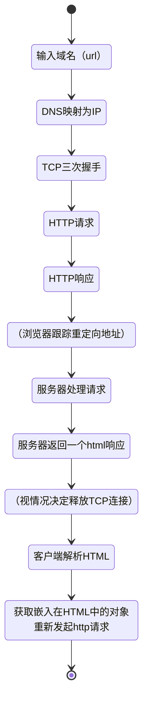

# 完整 HTTP 请求 - Web

1. 输入域名(url)
2. DNS 映射为 IP
3. TCP 三次握手
4. HTTP 请求
5. HTTP 响应
6. (浏览器跟踪重定向地址)
7. 服务器处理请求
8. 服务器返回一个 html 响应
9. (视情况决定释放 TCP 连接)
10. 客户端解析 HTML
11. 获取嵌入在 HTML 中的对象重新发起 http 请求

```mermaid
stateDiagram
    [*] --> 输入域名（url）
    输入域名（url） --> DNS映射为IP
    DNS映射为IP --> TCP三次握手
    TCP三次握手 --> HTTP请求
    HTTP请求 --> HTTP响应
    HTTP响应 --> （浏览器跟踪重定向地址）
    （浏览器跟踪重定向地址） --> 服务器处理请求
    服务器处理请求 --> 服务器返回一个html响应
    服务器返回一个html响应 --> （视情况决定释放TCP连接）
    （视情况决定释放TCP连接） --> 客户端解析HTML
    客户端解析HTML --> 获取嵌入在HTML中的对象重新发起http请求
    获取嵌入在HTML中的对象重新发起http请求 --> [*]
```
