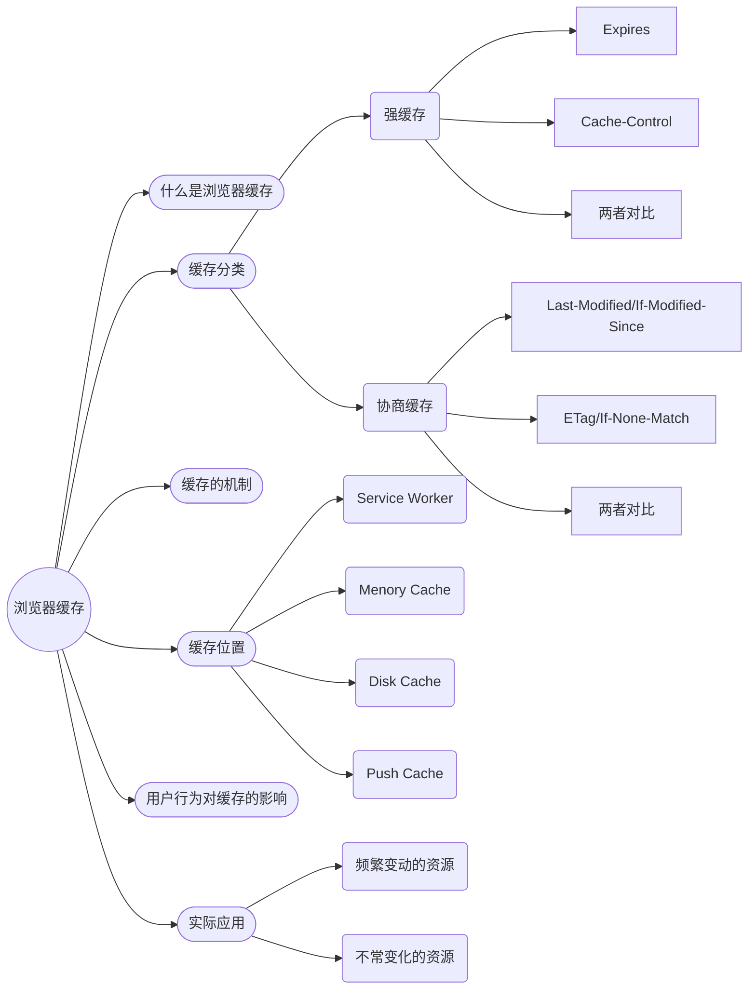

# 浏览器缓存 - Web

## 什么是浏览器缓存？

浏览器缓存(Brower Caching)是浏览器在本地磁盘对用户最近请求过的文档进行存储，当访问者再次访问同一页面时，浏览器就可以直接从本地磁盘加载文档。

浏览器缓存的优点有：

1. 减少了冗余的数据传输，节省了网费
2. 减少了服务器的负担，大大提升了网站的性能
3. 加快了客户端加载网页的速度

访问网页的时候，需要从服务器下载一些页面渲染所需的资源，比如 html 文档，css，js，图片等，有的资源是很少变动的，比如代表公司的 logo 图。如果把这些资源缓存下来，很自然减少了服务器的负载，而且页面加载时间也会缩短。

但是，要不要使用缓存，这个资源浏览器又要缓存多久，这些浏览器怎么知道？

## 浏览器缓存分类

### 强缓存

强缓存是利用 Expires 和 Cache-Control 这 2 个字段来控制的，控制资源缓存的时间，在有效期内不会去向服务器请求了。

### 协商缓存

协商缓存是由服务器来确定缓存资源是否可用，当然了，需要服务器和客户端一起配合。服务器可在 response header 中包含 Last-Modified 字段或者 ETag 字段。

## 浏览器缓存机制

总之，浏览器会根据 http response header 中的 Expires 和 cahe-control 字段判断是否命中强缓存，如若命中，则直接从缓存中取资源，不会再去向服务器请求了。否则（没有命中强缓存），浏览器会发出一个条件请求，浏览器会在请求头中包含 If-Modified-Since 或 If-None-Match 字段，If-Modified-Since 即浏览器当初得到的 Last-Modified；If-None-Match 即浏览器当初得到的 ETag。当服务器发现资源的更新时间晚于 If-Modified-Since 所提供的时间，或者资源在服务器端当前的 ETag 和 If-None-Match 提供的不符时，说明该资源需要向服务器重新请求了。否则，浏览器将不需要重新下载整个资源，只需要从缓存中去加载这个资源，这时响应的 http code 为 304（304 Not Modified）。

## 用户的操作对缓存的影响

| 用户操作         | Expires/Cache-Control | Last-Modified/Etag |
| ---------------- | --------------------- | ------------------ |
| 地址栏回车       | 有效                  | 有效               |
| 页面链接跳转     | 有效                  | 有效               |
| 新开窗口         | 有效                  | 有效               |
| 前进回退         | 有效                  | 有效               |
| F5 刷新          | 无效                  | 有效               |
| Ctrl+F5 强制刷新 | 无效                  | 无效               |

## 参考链接

- [前端面试浏览器系列：浏览器缓存](https://juejin.im/post/5cbfe16be51d456e500f7d35)
