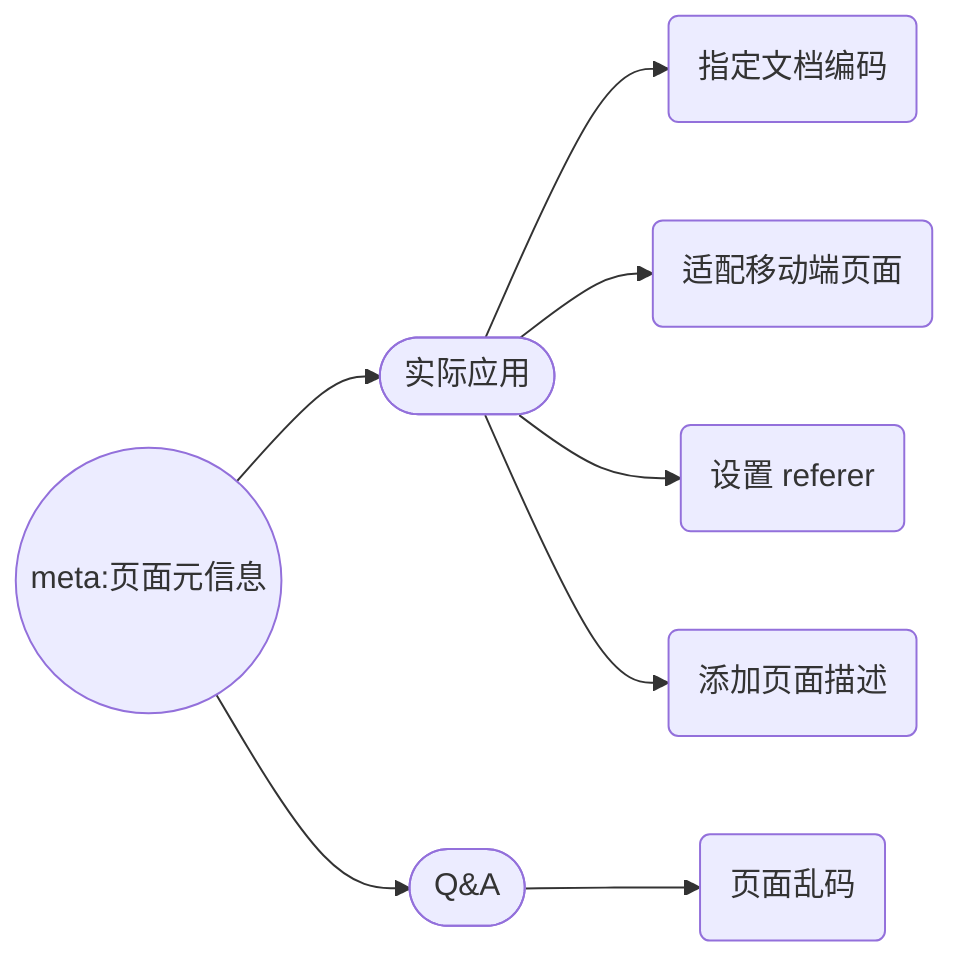

# meta - HTML Tag

`<meta>` 元素可提供有关页面的元信息（meta-information），比如针对搜索引擎和更新频度的描述和关键词。

`<meta>` 标签位于文档的头部，不包含任何内容。`<meta>` 标签的属性定义了与文档相关联的名称/值对。

注释：

1. `<meta>` 标签永远位于 head 元素内部。
2. 元数据总是以名称/值的形式被成对传递的。



## 实际应用

### 指定文档编码

```html
<meta charset="UTF-8" />
```

“charset” 是 `<meta>` 标记的属性，我们的开始标记都是可以有属性的。这里，我们要在 charset 属性中指定字符编码。
“UTF-8”是 Unicode 系列中的其中一个编码，这个编码是互联网上使用最广泛的一种 Unicode 的实现方式。它是为传输而设计的编码，并使编码无国界，这样就可以显示世界上所有文化的字符了——不管字母、数字还是中文、阿拉伯文等等。

### 适配移动端页面（理解并牢记）

```html
<meta
  name="viewport"
  content="width=device-width, user-scalable=no, initial-scale=1.0, maximum-scale=1.0, minimum-scale=1.0"
/>
```

- `width=device-width`  宽度 = 设备宽度
- `user-scalable=no`  用户缩放 = 不允许
- `initial-scale=1.0`  初始比例 = 1
- `maximum-scale=1.0` 最大比例 = 1
- `minimum-scale=1.0`  最小比例 = 1

### 设置 referer（图片所在的当前这个页面的地址）

```html
<meta name="referer" content="never" />
```

### 添加页面描述（即我们在搜索时看到的网站介绍）

```html
<meta
  name="description"
  content="优雅高效的在线文档编辑与协同工具，让每个企业轻松拥有文档中心，阿里巴巴集团内部"
/>
```

## Q&A

### 乱码？

当我们保存一个写好的 HTML 文件，编码方式会保存为 UTF-8 ；

一个文件就是一堆的数据，即我们写的内容变成了一堆的数据。那这个数据到底是变成了 123，还是 456 呢？

这里我们就用到了“编码”，用的编码方式不一样，那么数据呈现的状态就不一样；

然后，当我们把这个以适当编码方式保存好的数据再次展示在浏览器页面上时（或用其他编辑器打开时），那这个数据还要再恢复出来；

那这时候，浏览器（或编辑器）需要使用相同的、与文件相对应的编码方式去解码（但浏览器不是万能的，你不告诉它，它就不知道用什么方式去解码，它会随意地选择）；

这时，当编码是一种方式，而解码又是另一种方式时，页面就会出现“乱码”；

而解决乱码的方式就是：只需要知道我在编辑器保存这个 HTML 文件时，保存的是什么编码格式，然后在头部中告诉浏览器用什么方式来解码。
